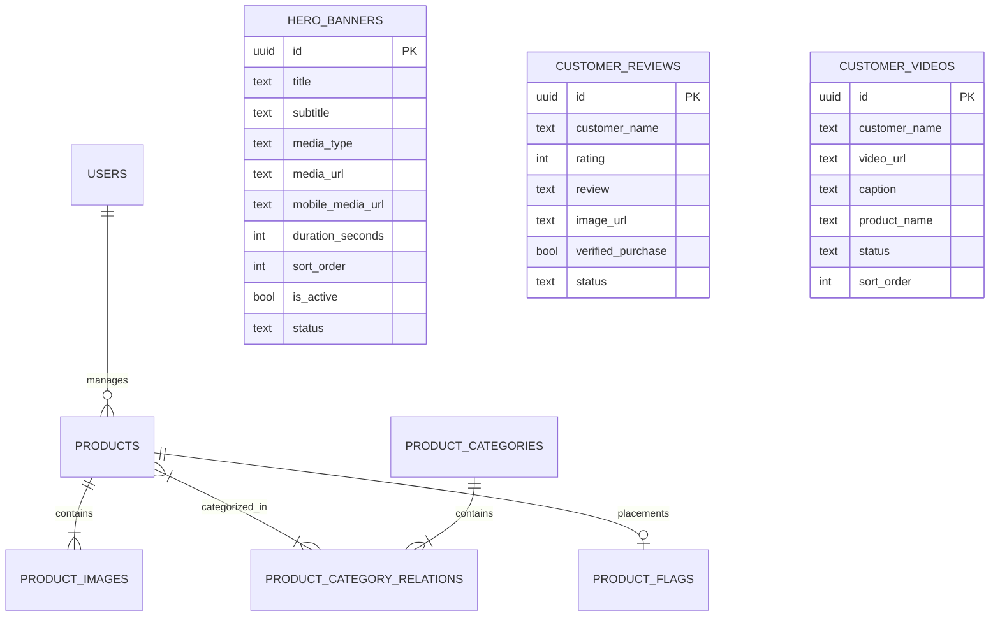

# DNORA — Database Architecture & Schema Specification

DNORA utilizes **Supabase PostgreSQL** as its relational database. The schema is fully normalized, indexed for high throughput, and protected by PostgreSQL Row Level Security (RLS) policies.

The complete executable SQL migration is located at [`lib/supabase/schema.sql`](lib/supabase/schema.sql).

---

## Entity Relationship Diagram



---

## Table Schemas & Specifications

### 1. `users`
Tracks authenticated patron accounts and administrative access privileges.
| Column | Type | Constraints | Description |
|---|---|---|---|
| `id` | UUID | PRIMARY KEY, REFERENCES auth.users | Bound to Supabase Auth user id |
| `email` | TEXT | NOT NULL, UNIQUE | User email address |
| `role` | TEXT | NOT NULL, DEFAULT 'customer' | 'admin' or 'customer' |
| `created_at` | TIMESTAMPTZ | NOT NULL, DEFAULT NOW() | Registration timestamp |
| `updated_at` | TIMESTAMPTZ | NOT NULL, DEFAULT NOW() | Last modification timestamp |

### 2. `products`
The core catalog table for luxury handbags and leather goods.
| Column | Type | Constraints | Description |
|---|---|---|---|
| `id` | UUID | PRIMARY KEY, DEFAULT uuid_generate_v4() | Unique product ID |
| `name` | TEXT | NOT NULL | Commercial handbag title |
| `slug` | TEXT | NOT NULL, UNIQUE | SEO-friendly URL identifier |
| `short_description` | TEXT | NOT NULL | Concise editorial summary |
| `description` | TEXT | NOT NULL | Full artisan craft description |
| `price` | DECIMAL(10,2)| NOT NULL, CHECK >= 0 | Unit retail price in USD |
| `compare_at_price`| DECIMAL(10,2)| CHECK IS NULL OR >= price | MSRP / strike-through price |
| `sku` | TEXT | NOT NULL, UNIQUE | Stock Keeping Unit code |
| `stock` | INTEGER | NOT NULL, DEFAULT 0, CHECK >= 0 | Available inventory units |
| `status` | TEXT | NOT NULL, DEFAULT 'draft' | 'draft', 'active', 'archived' |
| `created_at` | TIMESTAMPTZ | NOT NULL, DEFAULT NOW() | Creation timestamp |
| `updated_at` | TIMESTAMPTZ | NOT NULL, DEFAULT NOW() | Last update timestamp |

### 3. `product_images`
One-to-many relationship storing Cloudinary asset references.
| Column | Type | Constraints | Description |
|---|---|---|---|
| `id` | UUID | PRIMARY KEY, DEFAULT uuid_generate_v4() | Image ID |
| `product_id` | UUID | NOT NULL, REFERENCES products(id) ON DELETE CASCADE | Associated handbag |
| `cloudinary_public_id` | TEXT | NOT NULL | Cloudinary unique public ID |
| `secure_url` | TEXT | NOT NULL | Cloudinary HTTPS delivery URL |
| `alt_text` | TEXT | NOT NULL, DEFAULT '' | Accessibility description |
| `sort_order` | INTEGER | NOT NULL, DEFAULT 0 | Display sequence order |

### 4. `product_categories`
Taxonomy for handbag silhouettes (Shoulder Bags, Tote Bags, Crossbody Bags, Handbags, Mini Bags).
| Column | Type | Constraints | Description |
|---|---|---|---|
| `id` | UUID | PRIMARY KEY, DEFAULT uuid_generate_v4() | Category ID |
| `name` | TEXT | NOT NULL, UNIQUE | Display title |
| `slug` | TEXT | NOT NULL, UNIQUE | URL identifier |
| `image_url` | TEXT | NULLABLE | Editorial collection header image |
| `description` | TEXT | NULLABLE | Architectural silhouette description |

### 5. `hero_banners`
Cinematic homepage hero slider configurations.
| Column | Type | Constraints | Description |
|---|---|---|---|
| `id` | UUID | PRIMARY KEY, DEFAULT uuid_generate_v4() | Banner ID |
| `title` | TEXT | NOT NULL | Large editorial headline |
| `subtitle` | TEXT | NULLABLE | Drop / collection tag |
| `media_type` | TEXT | NOT NULL, CHECK in ('image', 'video') | Media asset type |
| `cloudinary_public_id` | TEXT | NULLABLE | Cloudinary storage ID |
| `media_url` | TEXT | NOT NULL | High-res desktop URL |
| `mobile_media_url` | TEXT | NULLABLE | Art-directed vertical mobile URL |
| `button_text` | TEXT | NOT NULL, DEFAULT 'Explore Collection' | CTA button label |
| `button_link` | TEXT | NOT NULL, DEFAULT '/shop' | CTA destination link |
| `duration_seconds` | INTEGER | NOT NULL, DEFAULT 5 | Image countdown timer |
| `sort_order` | INTEGER | NOT NULL, DEFAULT 0 | Slide display sequence |
| `is_active` | BOOLEAN | NOT NULL, DEFAULT true | Master toggle |
| `status` | TEXT | NOT NULL, DEFAULT 'draft' | 'draft', 'published', 'archived' |
| `text_alignment` | TEXT | NOT NULL, DEFAULT 'left' | 'left', 'center', 'right' |

---

## Performance Indexes

```sql
CREATE INDEX idx_products_slug ON public.products(slug);
CREATE INDEX idx_products_status ON public.products(status);
CREATE INDEX idx_product_images_product_id ON public.product_images(product_id, sort_order);
CREATE INDEX idx_product_flags_bestseller ON public.product_flags(is_best_seller) WHERE is_best_seller = true;
CREATE INDEX idx_product_flags_newarrival ON public.product_flags(is_new_arrival) WHERE is_new_arrival = true;
CREATE INDEX idx_hero_banners_status ON public.hero_banners(status, is_active, sort_order);
CREATE INDEX idx_customer_reviews_status ON public.customer_reviews(status);
CREATE INDEX idx_customer_videos_status ON public.customer_videos(status, sort_order);
```

---

## Row Level Security (RLS) Policies

All tables have RLS enabled.
- **Public Read Access**: Anonymous and customer users can only SELECT active products, categories, published hero banners (`status = 'published' AND is_active = true`), active customer reviews, and active UGC videos.
- **Admin Write Access**: Only authenticated users with `role = 'admin'` verified through the `public.is_admin()` security definer function can INSERT, UPDATE, or DELETE records.
